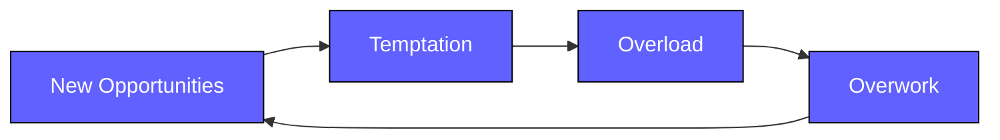

# Make the Time

Make The Time

Sefi Ninio | monday.com

<!--
Welcome everyone to Make the Time workshop.
Today we'll explore how to take control of your time and priorities.
-->

---
layout: center
class: text-center
---

Intro

# Before We Begin...

Let's reflect on some scenarios

---
layout: default
---

Intro

You've built the **perfect plan** for the week - calendar, time blocks, even breaks scheduled in.

<v-click>

By Wednesday, everything's off.

You've spent half your time firefighting and the other half rearranging your plan.

</v-click>

<v-clicks>

- How do you protect your focus time when others need you?

- How do you recover when your day doesn't go as planned?

- How do you make sure nothing falls between the cracks?

- Does time management ever feel like another task on your to-do list?

</v-clicks>

---
layout: default
---

Intro

# Sound Familiar?

Every task feels important - and everything needs to be done <em>yesterday.</em>

<v-clicks>

- How do you decide what truly matters in a day full of "priorities"?

- How do you balance between what's _urgent_ and what's _important_?

- What helps you focus when everything feels urgent?

</v-clicks>

<!--
Take a moment to think about these questions.
We'll explore answers throughout this workshop.
-->

---
layout: default
---

Intro

# How Do You Manage Your Time?

<v-clicks>

- How **intentional** are you about managing your time day to day?

- How do you currently decide **what to work on first** each day?

- What does a "productive" day mean to you — getting more done, or doing the **right things**?

- Does your day end with **cognitive load** — still thinking about tomorrow's tasks?

</v-clicks>

---
layout: default
hide: true
---

<v-clicks>

- How **intentional** are you about managing your time day to day?

- How do you currently decide **what to work on first** each day?

- What does a "productive" day mean to you — getting more done, or doing the **right things**?

- Does your day end with **cognitive load** — still thinking about tomorrow's tasks?

</v-clicks>

---
layout: default
---

Intro

# Why am I talking about this?

<v-click>

Before joining Monday.com, I worked for a **consulting company**

Managing **4-6 different calendars** simultaneously was my day-to-day norm

</v-click>

<v-click>

- A lot of context switching
- Many balls in the air
- Constant prioritization decisions

</v-click>

<v-click>

Over the years, I adapted a system that works well for me.

</v-click>

<!--
This isn't theoretical for me - I've lived this challenge.
-->

---
layout: default
hide: true
---

# The TLF Reality

TLF members experience something similar:

<v-clicks>

- Long-running initiatives
- Planned tasks AND unplanned tasks
- Incidents and firefighting
- Meetings and interviews
- Mentorship responsibilities
- Good old writing code

</v-clicks>

<v-click>

How do you find the time for everything?

</v-click>

---
layout: quote
hide: true
---

# We need a system that will help us manage our time and properly prioritize tasks

It might feel a bit like OCD and over-management overhead, but sticking to it will actually reduce cognitive load.

---
layout: center
---

Intro

# This is my take on it

You might want to take some of it, all of it, or none of it 🙂

---
layout: center
class: text-center
---

<!--
Ask the audience - what does 1440 mean?
Give them a moment to think...
-->

---
layout: center
---

1440

# The number of minutes in every single day

## No more, no less. For everyone.

<v-click>

  

> #### Why Minutes?

</v-click>

<!--
- **Seconds?** Too short to achieve anything meaningful

- **Hours?** Too long - A lot can be happen in an hour

- **Minutes?** Just right - a time frame big enough to achieve something

A few minutes is a time frame big enough to make progress.

A single task can span across multiple hours, but many tasks will take X minutes

Review a PR might be 15 mintes or 60 minutes, not 0.25 hour, 0.1 hour
-->

---
layout: statement
---

1440

# Time Management
# is a Myth

We do not manage time, we <strong>self-manage</strong> within <strong>time frames or constraints</strong>.

---
layout: section
---

The Churn

<!--
The Churn
-->

---
layout: default
---

The Churn

 

- Your day is packed

- You often feel overwhelmed

- You Have a hard time keeping all the balls in the air

- End of the day - Still thinking about missed tasks and worrying you'll miss something

---
layout: quote
hide: true
---

# "I'll procrastinate tomorrow"

---
layout: center
hide: true
---

# The Vicious Cycle

<v-clicks>

- **New opportunities** → Everything seems important
- **Temptation** → We want to do everything
- **Overload** → Too busy to think what's important
- **Overwork** → Work overtime to keep up

</v-clicks>

---
layout: center
---

C3PO Framework

<!--
It might feel a bit like OCD and over-management overhead (working like a droid), 
but sticking to it will actually reduce cognitive load and make sure nothing falls between the cracks
-->

---
layout: center
---

C3PO Framework

# C3PO Framework

<v-click>

C

Collection

C

Calendar

C

Concentration

P

Prioritize

O

Objective

</v-click>

<!--
So what is the c3po framework?
its how we collect tasks, how we schedule them, how we maintain concentration as we do them, how we prioritize them to achieve our goals
-->

---
layout: default
---

C3PO Framework

 

# C3PO Breakdown

<v-clicks>

- **Collection** → Tasks need to be collected properly in an <u>organized</u> manner

- **Calendar** → Tasks should be <u>scheduled</u> to a slot in the calendar

- **Concentration** → Task execution should be in a <u>focus-enabled</u> environment

- **Prioritize** → Tasks should be prioritized <u>predictably</u> in a way that serves us

- **Objective** → Long ongoing tasks should have a <u>scheduled routine</u>

</v-clicks>

<!--
* organized tasks
* slot allocation
-->

---
layout: section
class: text-center
background: /images/collection.png
---

How do you collect your tasks?

---
layout: two-cols-header
---

Collection

 

# Types of Work

::left::

### Shallow Work

- Simple tasks requiring almost no training
- Fast-paced, easily accomplished
- If highly trained, moderate tasks become simple

::right::

### Deep Work

- Moderate to hard tasks
- Push our cognitive abilities
- Produce substantial value or impact
- We grow and learn by doing them

<!--
Before we talk on the way to collect tasks, lets talk about types of work
-->

---
layout: default
---

Collection

 

# The Monday Way

Our primary task incoming channels:

- **Monday.com** - structured task management

- **Slack** - async communication and requests

<v-click>

The key is having a single source of truth for your tasks.

</v-click>

<!--
we cant keep some of the tasks in slack, some in email and others in board items - that is too much cognitive load that cannot be managed
-->

---
layout: default
---

Collection

 

# Task Collection Setup

Create a private board for your tasks:

1. Create a private Monday.com board
2. Invite `C3PO Service account` as contributor
3. Add these columns:
   - **Work** - Deep / Shallow (Autofill with AI!)
   - **Snooze** - Date | Date + Time
   - **Snooze details** - Text (Optional)

---
layout: default
---

Collection

 

# Slack Integration

1. Create a private Slack channel

2. Invite `@n8n BigBrain Agent`

3. Duplicate the n8n trigger flow template

4. Set flow config (treat the sub workflow as npm)

Now you have automated task reminders flowing between Monday and Slack!

---
layout: section
class: text-center
background: /images/calendar.png
---

If it's not in the calendar, it will not happen

<!--
# calendar
-->

---
layout: default
---

Calendar

 

# Calendar Philosophy

- **Reflect your daily routine** - both work and personal

- **Block time for deep work** - Don't let it get squeezed out

- **Keep empty slots** - So people can book time with you

- **Dedicated free time slots** - Interview slots, office hours

- **Respect personal time** - It's non-negotiable

---
layout: default
---

Most Important Task (MIT)

---
layout: default
---

Calendar

 

# Each day should have a slot for the daily MIT

The most important task(s) that should be completed today.

- Set daily repeating slots for **MITs**, focus time, deep and shallow work

- Most people are most effective in the **mornings**

- Find the MIT slots that work with **your schedule**

<!--
*

*

* like we said, respecting personal time etc.
-->

---
layout: section
class: text-center
background: /images/daily-focus-concentration.png
---

Reduce Cognitive Load

<!--
# Concentration
-->

---
layout: default
---

Concentration

 

# Work in Cycles

Work in cycles of <strong>30-90 minutes</strong>, then break.

<v-click>

You're probably already doing this intuitively.

</v-click>

<!--
<strong>The science:</strong> Our brains can only maintain deep focus for limited periods before needing recovery.

breaks are a good time to handle async messages etc.
-->

---
layout: default
---

Concentration

 

# Managing Notifications

To allow for deep work, reduce notification noise

- Set notifications to **mentions only** - don't miss something urgent

- Check async channels in **defined intervals** (every 2 hours? During breaks?)

- **Protect your focus** - urgent things will find you

<!--
we also have DOW
-->

---
layout: section
class: text-center
background: /images/daily-focus-priority.png
---

Prioritize

---
layout: default
---

Prioritize

 

# Task Prioritization

Prioritize by <strong>Importance</strong> (to me) and <strong>Urgency</strong>

<v-click>

A task is always important to the org, but in the context of Self Time Management - we want to spend time on what's <strong>important to us</strong> (aligns with our personal or position goals).

</v-click>

<v-click>

Ask yourself: <strong>"Is it important to me?"</strong>

</v-click>

---
layout: center
---

Eisenhower Matrix

<!--
I'll elaborate in a second, but first - what is an important task? an urgent one?
-->

---
layout: center
---

Prioritize

 

# Important Task

> ### An important task is one that meaningfully contributes to your **personal** or **leadership goals**, **team health**, **strategic impact**, or **long-term success** - even if it is small, fast, or not immediately due.

<!--
it is an important task - without any time constrains considered
-->

---
layout: quote
---

Prioritize

 

# Urgent Task

> ### An urgent task demands **immediate attention** because there is a time constraint, or delaying it would create negative consequences **right now**.

<!--
regardless if it is important to you or not
-->

---
layout: default
---

Prioritize

 

# Important + Urgent 
### Do ASAP

Tasks critical to your goals AND requiring immediate action.

<v-click>

**Examples:**
- Responding to a production issue impacting customers
- Fixing a deployment issue blocking the entire engineering team
- Providing final approval for a RC merge
- Quick but critical code review for a high-risk hotfix

</v-click>

<v-click>

These are unavoidable but should ideally be minimized through proactive planning

</v-click>

<!--
tasks that are important to you as well as time critical
-->

---
layout: default
---

Prioritize

 

# Important + Not Urgent
### Defer / Schedule to MIT

Tasks that drive high long-term value but don't demand immediate action.

<v-click>

**Examples:**
- Planning the next quarter's architecture roadmap
- Coaching a developer on decision-making
- Refactoring or paying down tech debt strategically
- Writing / reviewing ADRs

</v-click>

<v-click>

These should be prioritized intentionally - they generate compounding returns

</v-click>

<!--
I'll do them, as they are important to me, but I will do them later.
-->

---
layout: default
---

Prioritize

 

# Not Important + Urgent
### Delegate

Tasks that feel urgent but don't meaningfully advance your goals.

<v-click>

**Examples:**
- Random Slack pings asking for info they could find themselves
- Meetings where your presence adds minimal value
- Requests for "quick help" outside your area or goals
- Reviewing low-risk PRs someone else can review

</v-click>

<v-click>

Protect your focus from these. For someone else it might be Important + Urgent!

</v-click>

<!--
tasks that are not important to you, might be important to someone else
these are things that need to get done under a time constraint, just not necessarily by you.
-->

---
layout: default
---

Prioritize

 

# Not Important + Not Urgent 
### Delete

Tasks that add little value - minimize, postpone, or delete.

<v-click>

**Examples:**
- Responding to low-priority notifications
- Attending optional meetings that don't affect your work
- Reviewing low-impact PRs that others could handle

</v-click>

<v-click>

These drain energy and reduce your capacity for meaningful tasks

</v-click>

---
layout: default
---

Prioritize

 

# Zero Task Model

<strong>Zero open tasks at end of day</strong>

All tasks are:

- Labeled (Deep/Shallow)
- Scheduled (snoozed) to their respective allocated time slot
- Based on importance/urgency and MIT slots

<!--
To reduce cognitive load and be able to respect your off-work time
You dont have to keep thinking about this task or that, not forget to do something and just relax
-->

---
layout: center
---

Prioritize

---
layout: section
class: text-center
---

Saying NO

<!--
When you prioritize, sometimes you have to say "NO" 

Why? When?
-->

---
layout: default
---

Prioritize

 

# Why We Don't Say No

<v-clicks>

- **Fear of Disappointment** - Worry about letting others down

- **Fear of Conflict** - Reluctance to create tension

- **Fear of Incompetence** - Anxiety that refusing = inability to handle task

- **Fear of Exclusion (FOMO)** - Concern about missing growth opportunities

- **Fear of Perception** - Worry about being labeled "uncooperative"

</v-clicks>

<!--
Some of the reasons we normally avoid saying no when we actually should

* we might try to avoid letting people down

* sometimes we will try to avoid conflict

* we might fear that saying no might come across as incompetent in the task scope

* Sometimes something sounds interesting, to good to miss and not be part of

* or maybe just coming across as the one that doesn't help
-->

---
layout: default
---

Prioritize

 

# When It's OK to Say No

<v-clicks>

- **When you're at capacity** - Overcommitting leads to under-delivering. A clear "No" or "Not now" is better than a broken promise later.

- **When ROI is low** - True competence is knowing where you add the most value.

- **When it's "interesting" but not strategic** - Curiosity is not a business goal. If it doesn't align with OKRs, it's a distraction.

- **When it falls outside your core role** - Trying to do everything dilutes your effectiveness.

</v-clicks>

<!--
But sometimes it is actually OK to say no

* it's better to reflect load and balance with urgency - if you are at capacity and an urgent task comes in that you are the expert on, then use the tools we learned to prioritize, but assuming it is not urgent - either schedule or say no

* if your participation in the task does not produce real value, then its just noise, for all parties involved

* Now this can go both ways. Interesting might not be enough for CTA in the context of the task but sometimes this might lead to other better tasks - so with a pinch of salt

*
-->

---
layout: section
class: text-center
---

The S3 Rule

---
layout: default
---

Prioritize

 

# The S3 Rule

<strong>Schedule</strong> once, <strong>Snooze</strong> twice - then either delegate or do

- Allocating time is great, but expect the  unexpected - steals time slots

- That's unavoidable - but always **reschedule**

- If you keep putting out fires, your ability to self-manage diminishes

<v-click>

Each time you reschedule, re-evaluate importance & urgency

</v-click>

<!--
If you snooze too many times, it probably means that it's not important (so delegate or delete) or that as we snooze the importance or urgency is increased
-->

---
layout: section
class: text-center
---

Objective - Putting it all together

---
layout: default
---

Objective

 

# The Complete System

- **Collection** system for capturing tasks

- **Calendar** reflecting your free/busy time
- **Concentration** techniques for focus
- **Prioritization** based on urgency/importance

<v-click>

We can now allocate calendar time based on priority.

</v-click>

---
layout: default
---

Objective

 

# Daily Focus

If you have multiple deep tasks that must progress in parallel

<v-click>

Define a <strong>daily focus</strong> - each day the MIT is a different deep task

</v-click>

<v-click>

| Day | Focus |
|-----|-------|
| Sunday | Last Week Catch-up |
| Monday | ADRs |
| Tuesday | 1:1 meetings |
| Wednesday | Mentorship |
| Thursday | Publications |

</v-click>

<!--
so if I have, lets say, a blog post i need to work on, it'll always be on the Thursday MIT slot - unless it somehow becomes urgent
-->

---
layout: default
hide: true
---

# Key Rules

<v-clicks>

- **Do not multitask** - Focus on one thing at a time

- **Prioritize** - Eisenhower Matrix model

- **Use MIT slots** - Allocate them to specific deep tasks

- **Trust the system** - It only works if you trust it

</v-clicks>

---
layout: section
class: text-center
---

Summary

---
layout: center
---

Summary

 

# C3PO Recap

C

Collection

Organize tasks

C

Calendar

Schedule everything

C

Concentration

Protect focus

P

Prioritize

Urgent/Important

O

Objective

Daily focus

<!--
* We use Collection to organize tasks
* we use the calendar to schedule everything
* we utilize concentration techniques to protect our focus
* we prioritize based on urgency and importance
* and we leverage the daily MITs for ongoing efforts
-->

---
layout: default
---

Summary

 

# Your Action Items

1. Set up your task **collection board** in Monday.com

2. Set up your **reminders automation** in N8N

3. **Block MIT time** in your calendar every day

4. Protect your **concentration**

5. **Prioritize** with Eisenhower Matrix for every new task

6. Practice **'Saying No'** and **S3 rule** when appropriate

---
layout: center
class: text-center
hide: true
---

# Q&A

---
layout: end
class: text-center
---

# Thank You

Remember: You have 1440 minutes today

Make them count

Sefi Ninio | monday.com

